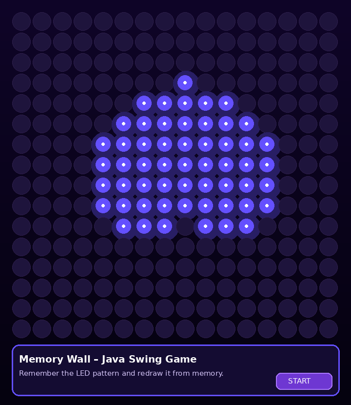

# 🎮 Memory Wall – Java Memory Game

Memory Wall is an interactive memory game developed in Java Swing. Players see a visual LED-style pattern for a few seconds and then try to redraw it from memory.



## 🧠 Project idea

This project simulates a 16 × 16 LED wall inspired by WS2812 LED rings. It was designed as a fun memory game for young users and as a practical Java project demonstrating GUI programming, event handling, and game logic.

## ✨ Features

- 16 × 16 interactive LED-style grid
- Predefined visual patterns such as heart, star, smiley, diamond, house, rocket and more
- Randomly generated patterns for variety
- Multiple game phases: countdown, show, hide, draw and result
- Mouse input: click or drag to draw the remembered pattern
- Score and level system
- Visual feedback for correct, wrong and missed cells
- Animated UI with Java Swing and AWT graphics

## 🛠 Technologies

- Java
- Swing (`javax.swing`)
- AWT Graphics
- Event-driven programming

## ▶️ How to run

### Option 1: IntelliJ IDEA

1. Open the project folder in IntelliJ IDEA.
2. Go to `src/MemoryWall.java`.
3. Run the `main` method.

### Option 2: Terminal

```bash
cd src
javac MemoryWall.java
java MemoryWall
```

## 📁 Project structure

```text
MemoryWall_GitHub/
├── src/
│   └── MemoryWall.java
├── screenshots/
│   └── memory-wall.png
├── README.md
└── .gitignore
```

## 👩‍💻 Author

Shaghayegh Raisi Nafchi  
Bachelor student in Informatics, FHNW  
Background in Computer Engineering and Web Development

## 📌 Note

This project was created as a personal learning project and portfolio project for entry-level IT / Junior Developer applications.
